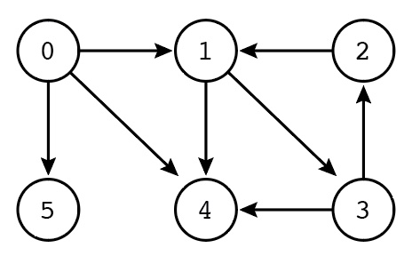
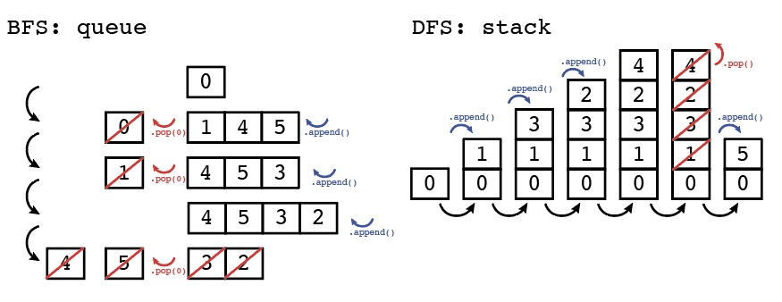
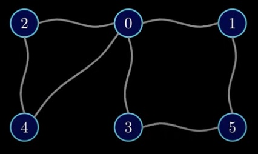
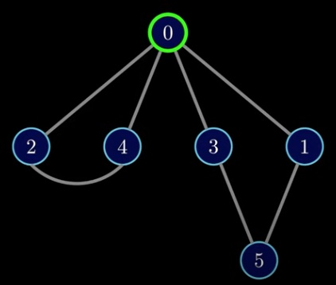
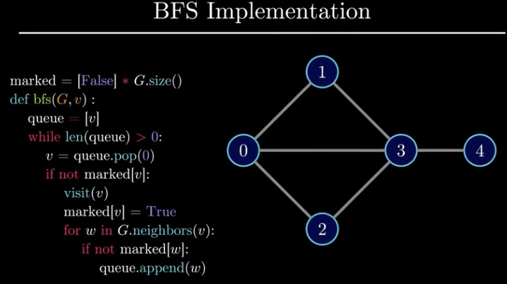
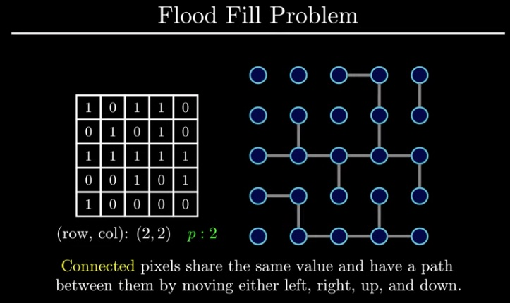

# Breadth-First-Search (BFS) & Depth-First-Search (DFS)

### Difference between DFS and BFS

In the following graph, BFS and DFS approach the vertices differently. 



| BFS    |DFS                            | 
| :----  | :----                         | 
| Node 0 | Node 0                        | 
| Node 1 | &emsp;  Node 1                | 
| Node 4 | &emsp;&emsp;    Node 3        | 
| Node 5 | &emsp;&emsp;&emsp;   Node 2   | 
| Node 3 | &emsp;&emsp;&emsp;  Node 4    | 
| Node 2 | Node 5                        | 

The general order of operation for a BFS (using queue) and DFS (using stack) are as follows:



## Breadth-First Search

Breadth-First-Search (BFS) can be used to fulfill the following:
1) Is there a path from node A to node B?
2) What is the shortest path from node A to node B?

Points:
1) Start BFS from any vertex. 
2) When at a vertex, visit adjacent vertex in any order.
3) When visiting a vertex, you must visit all adjacent vertices, before going to next vertex for exploration
4) Select the next vertex to explore using a **queue**.

> __Analogy for visualizing the order of graph exploration__  
> Imagine that a graph comprises balls and rubber bands. 
> Let's say in the following graph, we want to start traversal of graph at vertex 0. 
> 
> 
> 
> Pull up on the vertex of choice, and allow the other vertices to fall. 
> 
> 
> 
> The above image shows a natural order for breadth first search

When using BFS to find shortest path, start with a list that is the size of the graph to mark False or True which vertex has been visited.


__Example 1__



```
marked = [False] * G.size()
def bfs(G, v):
    queue = [v]
    while len(queue) > 0:
        v = queue.pop(0)
        if not marked[v]:
            visit (v)
            marked[v] = True
            for w in G.neighbors(v):
                if not marked{w}:
                    queue.append(w)
```

__Example 2__




```
# img -> grid, p -> pixel color

def floodFill(img, row, col, p)
    start = img[row][col]
    queue = [(row, col)]
    visited = set()

    # while queue is not empty
    while len(queue) > 0:   
        row, col = queue.pop(0)
        visited.add((row, col))
        img[row][col] = p
        for row, col in neighbors(img, row, col, start):
            if (row, col) not in visited:
                queue.append((row, col))
    return img

def neighbors(img, row, col, start):
    indices = [(row - 1, col), (row + 1, col), (row, col - 1), (row, col + 1)]
    return [(row, col) for row, col in indices if isValid(img, row, col) and img[row][col] == start]

def isValid(img, row, col):
    return row >= 0 and col >= 0 and row < len(img) and col < len(img[0])

```

## Depth-First Search

Depth-First-Search (BFS) can be used to fulfill the following:
1) Is there a cycle in a graph?
2) Is there a path from node A to node B? What are all possibilities?
3) One solution puzzles - sudoku, etc. 

Points:
1) Start BFS from any vertex. 
2) When visiting a new vertex, suspend the exploration of the current vertex, and explore that new vertex first. 
3) Use a **stack** to keep track of next vertext to explore.