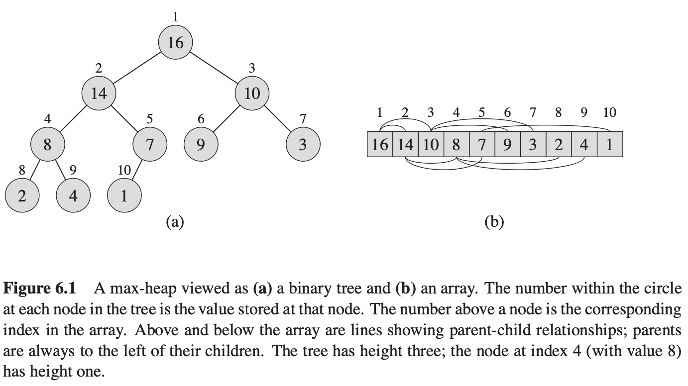

# Key algorithms / data structures

source: Introduction to Algorithms, third edition. Cormen, et. al. 2009. MIT Press.  

## 1. Heap 

    The (binary) heap data structure is an array object that can be viewed as a nearly complete binary tree. 

    Two variations of binary heap: Min-heap; max-heap

    Max heap: A[PARENT(i)] >= A[i]
    > 'A[PARENT(i)]' represents the value of the parent element of i in the array or heap
    > 'A[i]' represents the value of the element at index i in the array or heap 
    i.e. the value of a node is at most the value of its parent. 

    Min heap: A[PARENT(i)] <= A[i]
    i.e. the smallest element in a min-heap is at the root.

    'height of a node in a heap' -> number of edges on the longest simply downwart path from the node to a leaf.

    'height of a heap' -> height of the heap's root. 

    What are the minimum and maximum number of elements in a heap of height h?
    min: 2^(h-1) + 1
    max: 2^h - 1

    a heap with n elements will have a height of ⌊log₂n⌋

    top()       O(1)
    insert()    O(logn)
    remove()    O(logn)
    heapify()   O(n)

## 2. Sliding Window

## 3. Binary Search

## 4. DFS & BFS

## 5. Recursion

## 6. Hashmap

## 7. Dynamic Programming